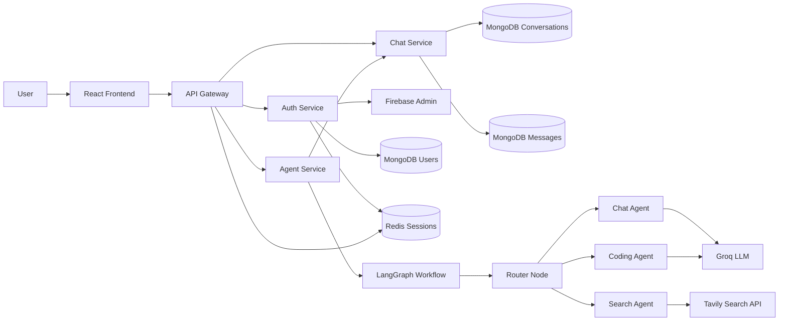

# AGENTFORGE

An AI chat application built with the MERN stack, microservices, LangGraph, Groq, Tavily, Redis, and Firebase authentication. The app supports authenticated conversations, persistent chat history, automatic/manual agent routing, web search grounded responses, and a frontend artifact panel for generated code previews.

## Features

- Google sign-in with Firebase Authentication
- Server-side session management with Redis
- API Gateway for routing protected requests to backend services
- MongoDB persistence for users, conversations, and messages
- LangGraph-based agent workflow
- Manual agent selection from the chat input
- Auto-routing mode that chooses the best agent for the prompt
- Groq-powered LLM responses across all agents
- Tavily-powered web search for current information
- React artifact panel with Code and Preview tabs
- Previewable HTML artifacts in a sandboxed iframe
- Responsive dark UI built with React, Redux Toolkit, Tailwind CSS, and Lucide icons

## Supported Agents

| Agent | Purpose |
| --- | --- |
| `auto` | Uses the router LLM to select the best agent |
| `chat` | General conversation, explanations, and learning |
| `coding` | Code generation, debugging, and architecture help |
| `search` | Web-backed answers using Tavily search results |

> Vision/image analysis is intentionally not active right now.

## Tech Stack

### Frontend

- React
- Vite
- Redux Toolkit
- Tailwind CSS
- Axios
- Firebase Web SDK
- Lucide React

### Backend

- Node.js
- Express
- MongoDB with Mongoose
- Redis with ioredis
- Firebase Admin SDK
- LangGraph
- LangChain
- Groq
- Tavily

### Architecture



## Project Structure

```text
.
├── Backend
│   ├── Gateway
│   │   ├── Controller
│   │   ├── Middleware
│   │   ├── utils
│   │   └── index.js
│   ├── Services
│   │   ├── Auth
│   │   │   ├── Config
│   │   │   ├── Controllers
│   │   │   ├── Models
│   │   │   ├── Routes
│   │   │   └── index.js
│   │   ├── Chat
│   │   │   ├── Config
│   │   │   ├── Controllers
│   │   │   ├── Models
│   │   │   ├── Routes
│   │   │   └── index.js
│   │   └── Agent
│   │       ├── Agents
│   │       ├── Config
│   │       ├── Controllers
│   │       ├── Graph
│   │       ├── Routes
│   │       ├── Utils
│   │       └── index.js
│   ├── Shared
│   │   └── redis
│   └── docker-compose.yml
├── Frontend
│   ├── public
│   ├── src
│   │   ├── Components
│   │   ├── Features
│   │   ├── Pages
│   │   └── Redux
│   └── Utils
└── README.md
```

## How It Works

1. The user signs in with Google.
2. The frontend sends the Firebase ID token to the Gateway.
3. The Gateway forwards login to the Auth Service.
4. The Auth Service verifies the token, creates/fetches the user, and stores a Redis session.
5. The frontend sends chat prompts to the Agent Service through the Gateway.
6. The selected frontend agent is passed into LangGraph.
7. If the selected agent is `auto`, the router LLM chooses `chat`, `coding`, or `search`.
8. If the selected agent is manual, LangGraph skips the router LLM decision and directly routes to that agent.
9. The Agent Service saves user and assistant messages through the Chat Service.
10. The frontend displays messages and opens previewable code artifacts when available.

## Agent Routing

The frontend sends an `agent` value with every chat request:

```json
{
  "prompt": "Search for the latest React news",
  "conversationId": "conversation_id_here",
  "agent": "search"
}
```

Allowed values:

```js
["auto", "chat", "coding", "search"]
```

Invalid values return a `400 Bad Request`.

### Auto Mode

When `agent` is `auto`, LangGraph calls the router node. The router LLM chooses the final `selectedAgent`.

Examples:

- "Hello" -> `chat`
- "Fix this JavaScript error" -> `coding`
- "Search latest React news" -> `search`

### Manual Mode

When the user selects `chat`, `coding`, or `search`, the router LLM is skipped. The selected agent is used directly.

## Web Search

The search agent uses Tavily to retrieve relevant web results. Those results are then passed to the LLM with instructions to answer using only the provided search context and include source links when available.

Required variable:

```env
TAVILY_API_KEY=your_tavily_api_key
```

## Artifacts

The frontend includes an artifact sidebar for generated code. It supports:

- Opening and closing the artifact panel
- Preview tab for rendered HTML apps
- Code tab for source code
- Sandboxed iframe rendering with `srcDoc`
- Calculator/MEA calculator artifact fallback for previewable examples

## Prerequisites

- Node.js 20+
- npm
- MongoDB connection string
- Redis instance
- Firebase project
- Firebase Admin service account JSON
- Groq API key
- Tavily API key

## Environment Variables

Create local `.env` files for each service. Do not commit real secrets.

### `Frontend/.env`

```env
VITE_FIREBASE_API_KEY=your_firebase_web_api_key
VITE_SERVER_URL=http://localhost:8000
```

### `Backend/Gateway/.env`

```env
PORT=8000
FRONTEND_URL=http://localhost:5173
AUTH_SERVICE=http://localhost:8001
CHAT_SERVICE=http://localhost:8002
AGENT_SERVICE=http://localhost:8003
REDIS_URL=redis://localhost:6379
```

### `Backend/Services/Auth/.env`

```env
PORT=8001
MONGO_AUTH_URL=your_mongodb_connection_string
REDIS_URL=redis://localhost:6379
```

Place your Firebase Admin service account at:

```text
Backend/Services/Auth/serviceAccountKey.json
```

This file is ignored by git.

### `Backend/Services/Chat/.env`

```env
PORT=8002
MONGO_AUTH_URL=your_mongodb_connection_string
```

### `Backend/Services/Agent/.env`

```env
PORT=8003
MONGO_AUTH_URL=your_mongodb_connection_string
CHAT_SERVICE=http://localhost:8002
REDIS_URL=redis://localhost:6379
GROQ_API_KEY=your_groq_api_key
TAVILY_API_KEY=your_tavily_api_key
```

## Installation

Install dependencies for each package:

```bash
cd Backend
npm install

cd Gateway
npm install

cd ../Services/Auth
npm install

cd ../Chat
npm install

cd ../Agent
npm install

cd ../../../Frontend
npm install
```

## Running Locally

Start Redis:

```bash
cd Backend
docker compose up -d
```

Start each backend service in separate terminals:

```bash
cd Backend/Services/Auth
npm run dev
```

```bash
cd Backend/Services/Chat
npm run dev
```

```bash
cd Backend/Services/Agent
npm run dev
```

```bash
cd Backend/Gateway
npm run dev
```

Start the frontend:

```bash
cd Frontend
npm run dev
```

Open the Vite URL shown in the terminal, usually:

```text
http://localhost:5173
```

## API Overview

### Gateway

| Method | Route | Description |
| --- | --- | --- |
| `GET` | `/` | Gateway health response |
| `GET` | `/api/v1/youridentity` | Returns current session user |
| `*` | `/api/v1/auth/*` | Proxies to Auth Service |
| `*` | `/api/v1/chat/*` | Protected proxy to Chat Service |
| `*` | `/api/v1/agent/*` | Protected proxy to Agent Service |

### Auth Service

| Method | Route | Description |
| --- | --- | --- |
| `POST` | `/login` | Verifies Firebase token and creates Redis session |
| `GET` | `/logout` | Clears the Redis session and cookie |

### Chat Service

| Method | Route | Description |
| --- | --- | --- |
| `GET` | `/create-conversation` | Creates a new conversation |
| `GET` | `/get-conversation` | Lists current user's conversations |
| `POST` | `/save-message` | Saves a message |
| `GET` | `/get-message/:conversationId` | Lists messages for a conversation |
| `POST` | `/update-conversation` | Updates conversation title |

### Agent Service

| Method | Route | Description |
| --- | --- | --- |
| `POST` | `/chat` | Runs the selected/auto-routed agent graph |

## Validation and Error Handling

- Protected routes require a valid Redis session cookie.
- Chat requests validate the selected agent.
- Invalid agents return `400 Bad Request`.
- Tavily failures are caught and passed back as search errors instead of crashing the app.
- Missing sessions return an authorization/session-expired response from the Gateway middleware.

## Build and Quality Checks

Frontend:

```bash
cd Frontend
npm run lint
npm run build
```

Backend syntax checks can be run manually with Node:

```bash
node --check Backend/Services/Agent/Config/llmModels.js
node --check Backend/Services/Agent/Controllers/agent.controllers.js
```

## Deployment Notes

Suggested production deployment:

- Frontend: Vercel, Netlify, or Render static site
- Gateway/Auth/Chat/Agent services: Render, Railway, AWS EC2/ECS, or Fly.io
- MongoDB: MongoDB Atlas
- Redis: Upstash, Redis Cloud, or managed Redis
- Environment variables: configure separately for each deployed service
- Cookies: set `secure: true` and production-safe `sameSite` settings for HTTPS deployment
- CORS: set `FRONTEND_URL` to the deployed frontend URL

## Security Notes

- Never commit `.env` files.
- Never commit `serviceAccountKey.json`.
- Rotate keys if they were exposed.
- Use HTTPS in production.
- Store sessions in Redis with expiration.
- Restrict CORS to trusted frontend origins.

## Future Improvements

- Add automated tests for services and reducers
- Add structured artifact protocol from the agent response
- Add streaming responses
- Improve deployment configuration with Dockerfiles for all services
- Add conversation deletion and renaming UI
- Add stronger request validation with a schema validator
- Add rate limiting at the Gateway
- Add observability/logging for service calls
- Add CI workflow for lint/build checks

## Author

Built by [Rakshit Negi](https://github.com/rakshitnegi1234).
